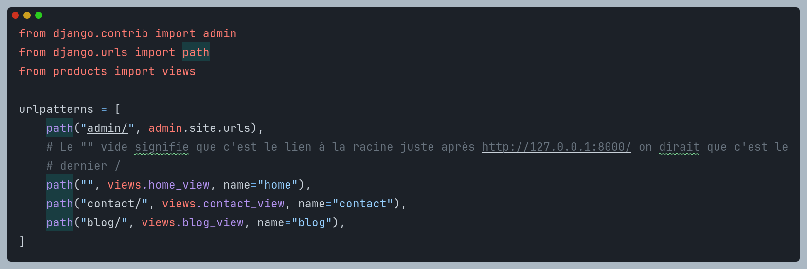
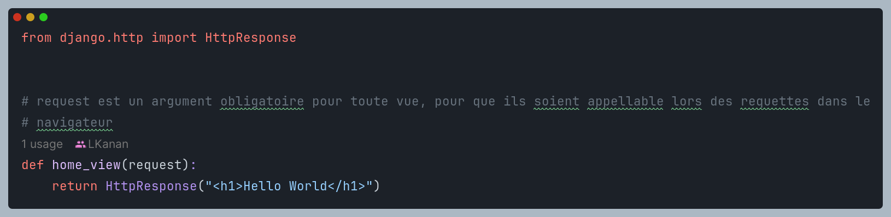

# Formation_Django

## 1. Quelques commandes utiles

- La commande `pip freeze` permet de lister tous les packages python installés dqns lùenvironne,ent virtuel ou global;
  et ceux ci accompagnés de leurs versions.
- On peut rediriger la sortie de cette commande dans un fichier .txt generalement nommé **requirements** en faisant la
  commande `pip freeze > requirements.txt` ce qui permettra à quelqu'un d'autres d'installer les memes dependances pour
  un projet similaire en executant la commande `pip install -r requirements.txt`.
- La methode **dir()** permet de montrer les methode et attibuts d'instance d'une librairie qu'on a importé, par exemple
  on peut visualiser les methodes et attributs d'instance de la librairie pathlib en executant ce
  code:

```
import pathlib

dir(pathlib)
```

Ou encore, on peut visualiser les attibuts et methode d'instance de la classe Path de pathlib en faisant:

```
from pathlib import Path

dir(Path)
```

- La commande **`pwd`** dans le terminal permet de recuperer le chemin complet vers le dossier actuel. Elle signifie
  Present Working Directory.

## 2. Création d'un projet et une application django

- Pour créer un projet django on utilise la commande `django-admin startproject nom_du_projet`, ceci créera
  l'architecture minimale d'un projet django avec tous les dossiers et fichiers nécessaires.
- La difference entre un **projet** et une **application** django est que un projet peut contenir plusieurs applications
  django, une application django c'est une facon de subdiviser un projet en petites application qui peuvent etre
  réutilisé dans un autre projet qui nécessite la meme foonctionnalité.
- Pour créer une application django on utilise la commande `django-admin startapp nom_application`, ceci créera ausi la
  structure minimale d'une application django.  
  **Nb: Ne pas oublier de se placer dans le dossier du projet dans le terminal avant la création de l'application.**

## 3. Lancer le serveur django

- Pour lancer le serveur de django et tester le programme il faut d'abord s'assurer d'etre dans le dossier du projet
  dans le terminal et ensuite taper la commande `python manage.py runserver` et pour arreter le serveur dans le
  terminale il faut combiner les touches **Ctrl+c**. Ceci va nous donner le lien qui nous permettra d'acceder à notre
  site dans le navigateur et par defaut c'est *http://127.0.0.1:8000/*, si on entre ce lien dansun navigateur on aura
  une page par defaut de django qui va s'afficher pour nous permettre de nous rendre compte que notre application a bien
  été initialisé.

## 4. Explication de certaines lignes dans le fichier settings.py du projet django

- `BASE_DIR` est une variable qui contient la racine de differnets fichiers de notre projet
- `SECRET_KEY` c'est une variable qui contient une clé secrete du projet et il faut savoir que chaque projet django a sa
  clé secrete et on peut la modifier en inserant d'autre caractere ou en eliminant certains pour la personaliser.
- `DEBUG` c'est une variable booléene qui lorsqu'elle est égale à *True* si notre site renvoi des erreur ces erreurs
  nous seront montrées avec certaines précisions assez technique pour faciliter le debogage c'est pourquoi il recommandé
  de la mettre à *False* lorsqu'on veut deployer le site et là aucune erreur ne sera montrée.
- `ALLOW_HOST` est une variable qui va contenir un nom de domaine pour lequel, s'il est entré dans un navigateur
  celui-ci permettra aussi de lance notre site.
- `INSTALLED_APPS` c'est une variable qui contient toutes les application créées dans notre projet, et donc à chqaue
  fois aue nous créons un projet on doit venir ajouter son nom sur cette liste pour qu'elle soit reconnu sinon au cas où
  on tenterait de l'utiliser sans l'avoir ajouter à la liste dans les settings, cela va nous genenerer des erreurs.
- `MIDDLEWARE` c'est une variable qui contient une liste d'élements pour la securité et l'authentification.
- `ROOT_URLCONFIG` c'est une variable qui contient le chemin ou la localisation du fichier dans lequel nos root ou nos
  urls seront stockés.

[//]: # (TODO: Il faut expliquer  ce point lorsque je vais y arriver)

- `TEMPLATES`
- `WSGI_APPLICATION` on dirait qui représente notre serveur local.
- `DATABASE` c'est une variable qui contient la spécification de la *SGBD* que l'on va utiliser pour notre projet et par
  defaut django nous permet d'utiliser *SQL* et specifie le chemin de la base de données utilisée, exemple par defaut on
  a : `'NAME': BASE_DIR/ 'db.sqlite3'` puisque *BASE_DIRE* represente la racine qui est notre projet alors on pointe
  vers le fichier *db.sqlite3* si on change cette valeur et qu'on relance le serveur on verra que le nouveau nom sera
  ajouter comme fichier à la racine de notre projet s'il n'existe pas encore.
- `AUTH_PASSWORD_VALIDATORS` c'est une variable qui contient la liste des differentes erreurs qui peuvent etre levées
  lors de la monipulation des mots de passe
- `LANGUAGE_CODE` c'est une variable qui contient la langue par defaut de notre site, on peut changer sa valeur, par
  exemple lorsque on leve des erreur de mot de passe si la valeur est à l'anglais l'erreur sera levé en anglais mais si
  c'est en francais le message sera en francais et meme l'interface d'administration prend la langue définie, si on
  change la langue ici, meme dans l'interface d'administration tout sera configurer dans cette langue là.
- `TIME_ZONE` est aussi une variable pour signifier le fuseau horaire utilisé par notre site
- `STATIC_URL` c'est une variable qui permet de signifier que tous les fichiers static(ex: les fichiers css, js et les
  images) seront dans le dossier parent au nom de `static/`, ce qui fera que lorsque dans un fichier on veut mettre un
  chemin vers un fichier static on aura meme pas besoi d'ecrire le chemin en commencant par le mot static on aura qu'a
  commencé par le fichier ou le dossier qui vient directement dans le dossier static.

[//]: # (TODO: Il faut expliquer  ce point lorsque je vais y arriver)

- `DEFAULT_AUTO_FIELD`

## 5. Fonctionnement du localhost et du superuser

- **Le localhost**  
  Quand on lance le serveur django il lance notre application à l'adresse *http://127.0.0.1:8000/*; **http://127.0.0.1:
  **  
  represente l'adresse local de toute machine et **8000/** est le port par defaut sur lequel notre application est
  lancée mais on peut personnaliser le port sur lequel notre application sera lancée en executant la
  commande `python manage.py runserver custom_port`, ex: `python manage.py runserver 8070` cette commande lancera notre
  application sur le port 8070 et notre site sera accessible à l'adresse *http://127.0.0.1:8070/*. Ceci peut nous etre
  utile lorsque on a lancé plusieurs application au meme moment et ainsi on poura evite des conflits des ports, pour
  cahque application son port.
- **Le superuser**  
  La commande `python manage.py migrate` permet de mettre à jour les modifications effectuées sur la structure des
  tables(models) de la base de données et chaque fois qu'on effectue les migrations le dossier créé enregistre l'etat de
  la base de données avec son contenu, on peut effacer les nouvelles migrations pour rentrer à un état anterieur de la
  base de données, si ces mise à jour ne sont pas faits, les modifications de la structure des tables ne seronts pas
  pris en compte.  
  Avant le lancement du serveur surtout pour la première fois, il est conseillé d'executer cette commande.
  Le **supersuser** est considerer comme l'administrateur du site web c'est un utilisateur qui a accès à l'interface d'
  administretion.
  Pour créer un superuser ou l'utilisateur administrateur on execute la commande `python manage.py createsuperuser` puis
  on suit les etapes pour définir le nom, l'adresse e-mail et le mot de passe. et il n'y a que ce superuser qui peut
  acceder à l'interface d'administration au lien http://127.0.0.1:8000/admin.

## 6. Explication en profondeur de l'architecture minimale d'une application django

L'architecture d'un projet django est en **MVT** contrqirement dans d'autres langage de programmation qui parlent du
**MVC**:

- Le **M** pour dire **Model**, il fait allusion à la base de données et l'architecture de ses tables.
- Le **V** pour dire **View**, généralement il fait allusion à ce qui est visible(le fontend) mais en django le *View*
  se comporte comme le controller.
- Le **C** pour dire **Controler**, il fait allusion à la communication entre les *Views* et *les models*, il joue le
  role du passage intermediaire qui permet l'affichage dans les *Views* des données de la base de donné *models*.  
  En django le **C** est remplacé par **T** pour dire **template**.Et c'est ce *Template* qui prend le role de *View*
  comme dans d'autres architectures.

Une application django est un package qui contient:

- Un dossier **migrations**, c'est un package qui permet d'enregistrer l'architecture de nos tables à et leurs contenus
  dans la base de données à chaque fois qu'on fait des mise à jour d'architecture nos tables(models) comme des dossiers
  pour que ces modifications soient visibles dans l'interface d'administration et cela peut constituer en quelques
  sortes comme un historique des modifications des architectures des tables de notre base de donnnées.
- Le fichier **views.py** est celui qui va contenir nos liens avec la partie *frontend* et chaque lien avec le
  *frontend*
  est une foncton python qui renvoi soit une valeur, soit du JSON.
- Le fichier **models.py** nous permet de créer nos différentes tables pour la base de données, toutes nos tables sont
  sous forme des classes python et doivent héiriter de la classe **Model** qui est un model concu dans django et qui
  contient les nécessaire pour la crétion de nos nouveaux models, cela se fera à l'exemple la syntaxe:

```
from django.db import models

class Custom_model(models.Model):
  ...
```

Par défaut django ajoute un "s" à la fin du nom de chaque table qui est aussi par défaut le nom de la classe pour
designer son pluriel et ce nom est utilisé dans l'interface d'administration, ce qui fait que si on a un nom de table
qui possede déjàun "s" on se retrouve dans l'interface d'administration avec un nom de table avec double "ss", du coup
pour changer ce comportememnt par défaut et définir par nous meme le nom et le pluriel du nom de la table, nous devons
ecrire les meta données(meta data) de la classe de notre table avec une syntaxe ci-dessous dans une sous classe appelée:
**Meta**:

```
from django.db import models

class Custom_model(models.Model):
  class Meta:
    #Pour le nom de la table
    verbose_name="custom_name_table"
    #Pour le pluriel du nom de la table
    verbose_name_plural="custom_plural_name_table"
```

Par défaut les noms de nos objets dans les tables est sous format *nom_Classe(ID)* de l'objet, pour personnaliser ce non
on doit surcharger methode __str__  dans les differentes classes, cette methode nour renvoi la cahine de caractère qui
va représenter le nom de chaque objet de la classe, par exemple pour faire à ce que chaque objet ou enregistrement de
la table soit reconnu par son nom, on fait:

```
def __str__(self):
    return self.name
```

Il faut savoir qu'on peut prendre n'importe quel attribut ou meme la concateation de ses attributs pour designer le nom
de l'objet.

Les *champs* d'un model représentent les colonnes de la table et ces champs doivent prendre des types, concernant les
types et leurs arguments obligatoire on doit se referer à la documentation de django en ligne.  
A chaque qu'on vient de modifier quelque chose dans le fichier *models.py* ondoit taper ces deux commandes pour mettre a
jour ces modifications dans la base de données:`python manage.py makemigrations` et `python manage.py migrate`.  
La première commande créera à chqaue fois un fichier python traduit de notre models avec son architecture actuel en le
numérotant; la deuxieme commande viendra comme pour valider les modifications faites dans la base de données.
Pour que nos modifiactions soient visibles dans l'interface d'admninistration on doit traiter cette visualistion dans le
fichiers **admin.py** de notre application

- Le fichier **admin.py** permet de gerer la visualisation de nos tables et leurs champs dans l'interface d'
  administration.
  Pour afficher le contenu de la base de données d'une facon minimale ce qui affichera seulement le nom des objets,
  on peut faire:

```
from django.contrib import admin
from .models import Custom_name_class

admin.site.register(Custom_name_class)
```

Mais pour afficher le contenu de la base de données sous forme d'une table en Lignes X Colones on doit augmenter les
attributs à afficher de cette facon:

```
from django.contrib import admin
from .models import Custom_name_class


class AdminCustom_name_class(admin.ModelAdmin):
    # list_display contient les noms des attributs à afficher, à l'exemple de ca:
    list_display = ("id", "name", "description", "price")

# Ensuite on doit ajouter la classe créée dans admin.site.register
admin.site.register(Custom_name_class, AdminCustom_name_class)
```

L'application centrale qui porte meme le nom du projet a un fichier **urls.py**, ce fichier permet de gerer les routes(
*liens*) de notre site ou projet. chaque *View(Controler)* est caractérisé par un lien qui mène à elle, et c'est grace à
ce lien qu'on peut acceder à un *controler* qui est lui meme dejà associé à une vue(template).

## 6. Interaction avec la base de donnés par le terminal(Shell)

- Pour lancer le shell interactif on tape la commande `python manage.py shell`
- Pour fermet cette console interactive on tape la combinaison **Ctrl+D**
- Pour interagir avec une table de notre BDD on doit importer la classe de cette table dans le shell en faisant un:
  `from nom_application.models import NomClasse`
- **Création d'un nouvel objet(enregistrement)**  
  une fois importé la classe importée on crée un enregistrement en créant evidement un objet et en completants les
  valeurs des attributs

```
new = NomClasse.objects.create(attrib1= valeur1, attrib2= valeur2, attrib3= valeur3)
new.save()
```

On peut visualiser à quoi correspond l'objet new dans le terminal en tapant juste `new` puis la touche **Enter** cela
nous affichera le nom de l'objet, celui defini par la surcharge de la methode `__str__`.  
On peut aussi visualiser le contenu des différents attributs d'un objet en faisant par exemple `new.attrib1`, cela
affichera le contenu de *attrib1* pour cet objet.

## 7.Traitement des problemes liés à l'ajout des attributs lorsqu'il exite déjà des élements dans la BDD avec les anciens attributs

L'erreur est du type:

```
It is impossible to add a non-nullable field 'nom_attribut' to nom_table without specifying a default. This is because 
the database needs something to populate existing rows.
Please select a fix:
 1) Provide a one-off default now (will be set on all existing rows with a null value for this column)
 2) Quit and manually define a default value in models.py.
Select an option: 2
```

On peut avoir 3 facons de gerer ce probleme mais deux sont les plus conseillées et une est utilisé en cas de force
majeur.

1. **Methode d'effacement des dossiers `migrations` et `__pycache__` et du fichiers contenant la BDD**
   Cette methode est utilisée seulement si on a plus besoin des éléments se trouvant déjà dans la BDD, puisque ceci
   revient
   à réunitialiser la BDD pour créer des nouveaux élements ayant les meme attributs au départ.  
   Apres avoir supprimer ces élements, il faut retaper les commandes `python manage.py makemigrations`
   et `python manage.py migrate` et une fois apres avoir relancer le serveur, il faudra recréer un superuser puisque
   l'ancien est parti avec l'ancienne BDD effacée, en executant la commande `python manage.py createsuperuser`.
2. **Methode du passage d'une valeur par defaut de l'attribut**
   Cette methode consiste à donner une valeur par defaut à au champ, de cette facon meme les enregistrement n'ayant pas
   cet
   attribut au départ l'auront avec la valeur par defaut selon le type du champ, les champs de type booleen prendront
   soit
   *True* soit *False* et les string prendront une *chaine de caracteres*, les numeriques prendront un *nombre*, et on
   aura evité d'avoir de probleme.
   Exemple: `actif = models.BooleanField(default=True)`
3. **Methode d'acceptation d'avoir une valeur Null ou vide comme valeur d'un champ pour un enregistrement**
   Cette methode consiste à definir dans les arguments du type du champs `null=True` ou `blanck=True` qui sont par
   defaut à
   False, la différence entre ces deux c'est que l'attribut le premier permet de définir qu'on peut enregistrer un
   element
   dans la base de donnée sans donner la valeur à ce champs et le second permet de définir qu'on peut valider un
   formulaire
   avec le champ de saisie de cet attribut vide et du coup dans la base de données ce champs devient optionnel. Et la
   valeur pour ces genres de champs c'est NULL.

## 8. Fonctionnement des requetes et des urls

Dans une vue comme etant une fonction, elle doit oligatoirement prendre en parametre un objet de type **request** qui
represente la requete faite par l'utilisateur et contient enormement d'imformation comme la methode de requete lancée et
meme l'url vers laquelle la requete pointe, par exemple si on essaye d'afficher le contenu de request lors de la requete
vers la homepage on a quelque chose qui ressemble à ca: `<WSGIRequest: GET '/'>`; **WSGIRequest** c'est pour le serveur
en local, **GET** est
la methode de requete et elle pointe vers l'url à la racine **/**.  
Et en faisant `request.user` on peut voir l'utilisateur qui a fait la requete, si c'est un utilisateur anonyme on aura
un attribut `AnonymousUser` qui est un objet de django qui represente un utilisateur anonyme. et en
faisant `request.path` on peut voir l'url vers laquelle la requete pointe, et en faisant `request.method` on peut voir
la methode de requete utilisée. Et plein d'autre de ses attributs qu'on peut voir en faisant un print(dir(request)).

Concernant les urls, on les definit soit dans le fichier **urls.py de l'application** soit dans le fichier **urls.py du
projet** et concernant leurs définitions dans le fichier **url.py du projet** c'est comme sur l'image qui suit :

Comme sur cette image on a besoin d'importer **path**, la methode **path** est celle qui va nous permettre de créer des
urls, elle prend en premier paramettre le lien que nous voulons créer finissant toujours par un **/**, en deuxième
parametre il prend le chemin qui indique la vue se trouvant dans un fichier view.py d'une application et en troisième
paramettre il premd le nom qu'on veut donner à notre url dans le projet, celui-ci est optionnel bien qu'important et les
fichiers qui contiennent les vues dans les différentes applications comme par exemple: `from products import views`, on
a importé le fichier view de notre application **produits**, et pour créer un lien il faut savoir que tous les liens que
nous allons créer seront ecrits apres le `http://127.0.0.1:8000/`, par exemple pour definir le chemin vers une vue
**contact_view** qu'on a créé dans le fichier view.py de notre application products, on fera
maintenant: `path("contact/", views.contact_view, name="contact")`.

## 9. Configuration des templates

On a apris que pour générer ou renvoyer un texte sur une page avec une vue on peut faire un code du genre :
, on a besoin d'imprter **HttpResponse** pour que
la vue puisse renvoyer un texte sur une page web.  
Et apres pour qu'une vue renvoi un un texte on doit l'associer à un url dans le fichier urls.py de l'application, et
elle doit retourner un HttpResponse() avec le texte à renvoyer par exemple pour renvoyer un texte sur la page d'accueil
on peut faire:

```
def home_view(request):
    return HttpResponse("<h1>Hello World</h1>")
```

ici on met la syntaxe du html pour que le navigateur puisse le mettre en forme vu que c'est du HTML ou on peut aussi
faire simplement:

```
def home_view(request):
    return HttpResponse("Hello World")
```

Mais ca ne sera pas bien reconnu par le navigateur pour la mise en forme.

Alors pour retourner un template ou un texte html bien structuré dans un fichier html on ne va plus utiliser la methode
HttpResponse() mais la methode **render()** qui prend en parametre la requete(request), le nom du fichier html et un
dictionnaire(context) contenant les données à passer au template, par exemples des donnée venant de la base de données.

Lorsque nous avons nos templates HTML à afficher dans le dossier du projet django on les places dans un dossier appelé *
*templates** à la
racine de notre application, et pour que django puisse les reconnaitre il faut ajouter ce dossier dans la liste des
dossiers de templates dans le fichier **settings.py** du projet, on doit ajouter le chemin vers le dossier templates
dans la variable **TEMPLATES** dans la liste **DIRS**, ce qui permet lorsque on doit mettre le chemin vers un template
de donner seulement le nom du fichier sans le chemin complet, par exemple si on a un fichier **home.html** dans le
dossier **templates** de notre application, on peut le renvoyer dans une vue en
faisant: `return render(request, "home.html")`. Et si on veut placer nos templates dans un dossier templates à
l'interieur de nos applications vu que le chemin vers le dossier templates est reconnu par defaut par django par la
ligne `'APP_DIRS': True,` dans la definition des dossiers de templates dans les **settings.py** alors on doit ajouter un
dossier ayant le nom de notre application dans ce dossier templates et c'est dans celui-ci que nous
mettrons nos templates afin d'eviter les conflits entre les fichiers de meme nom dans differentes applications. Une fois
celà fait que si on doit mettre le chemin vers un template dans une vue il suffira de donner seulement le nom le chemin
commencant par le nom_de_application/nom_ficher, par exemple si on a un fichier dans une application my_app on
a:  `return render(request, "my_app/home.html")`.

## 10. Utilisation des variables dans le template en django

Ceci fait appel au template engine de django qui est un moteur de rendu de template qui permet de generer des pages web
à partir de templates HTML et de données dynamiques.
Pour afficher des valeurs de variables dans un template on doit d'abord passer ces variables dans un dictionnaire dans
la vue qui renvoi le template, par exemple si on a une variable **name** qu'on veut afficher dans un template on doit la
passer dans un dictionnaire dans la vue qui renvoi le template, par
exemple: `return render(request, "home.html", {"name": "John"})`, et pour afficher cette variable dans le template on
utilise la syntaxe `{{ name }}` dans le fichier html dans un élement ce qui permet d'afficher la valeur de la variable 
**name** dans le template, et on peut aussi faire des operations sur les variables dans le template, par exemple si on a
une variable **price** et qu'on veut afficher le prix avec une tva de 20% on peut faire: `{{ price*1.2 }}`.